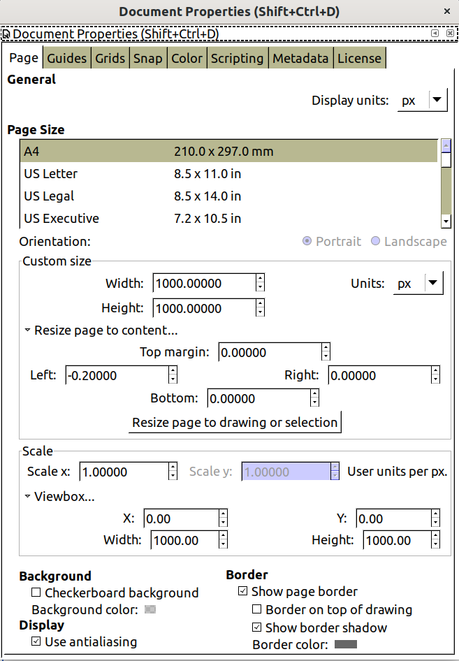

SVGs are a great option for making simple, scalable graphics, logos, and animations. [Inkscape](https://inkscape.org/) is a free open source program for making [SVGs](https://inkscape.org/develop/about-svg/).

It's great to draw cool stuff in Inkscape, but it's a pain to get Inkscape SVGs to display properly on the web. We'll show you how to clean up SVGs so when you save them so they obey CSS rules.

## Setting Your Document Properties

Check in on your Document Properties by going to `File > Document Properties.` Here you'll manage unit size and canvas size.

### Keeping Inkscape In Pixels and Sizing Properly

Check that your `Display Units` and `Units` are set to `px`. In this interface, you can also size canvas you're using. We like starting with a 1000 x 1000 pixel square. While you're here, setting the `Viewbox` fields to start at 0,0 and be 1000 units wide makes reasoning about your SVG much easier.

### Making SVGs Smaller

By default, SVG gives you a lot of numerical precision when making SVGs. On the web, this can be a liability, and make edits much harder. Reduce the size of your files by going to `Edit > Preferences`, find the `SVG Output` option, and reduce the `Numerical precision` to 1 or 2 to save decimal places.

### Saving Work For Later

Inkscape provides templates for saving work you'll commonly set. Once you set up your display units and canvas size, use those defaults by saving a `default.svg` file. Then, every SVG you make in the future will have those properties.

Find out where to save your template by checking your `Preferences` , then finding `System`. There, you'll see the `User config:` field. That folder will contain a `templates` directory. Save your configured, blank SVG as `default.svg` in that templates folder and skip setup next time.

## Draw Something Cool

Second step: draw an SVG in Inkscape. We drew this!

### Resizing The Canvas

Once your drawing is done, you'll often want to resize the canvas. Go back to `Document Properties`, and expand `Resize page to content...`, set any margins you want, then click `Resize page to drawing or selection`.

## Removing Tags with the XML Editor

Once everything is in pixels, the heart of cleaning your SVG is removing a bunch of unwanted Inkscape defaults. Under `Edit > XML Editor` you'll open an `XML Editor` interface for directly modifying the text output for the SVG. Give this screen space, you'll want it.

### Fixing Size In The `<svg:svg>` Base Element

Get the lowest level of your SVG you get by clicking `svg:svg` in the `XML Editor`. Immediately delete the inline `width` and `height` attributes. Inkscape will replace them with a default 100% value, which means your SVG will fill a container `div` element. 

Clean up your code by editing the \`id\` element while you're here. It's very powerful to apply JavaScript to SVGs, start by giving things descriptive element names.

### Keeping Your CSS Style By Editing `<svg:path>`

Inkscape puts SVG styles inline on path elements. Click on each `path`, select the `style` element, and click `Delete Attribute`. This is also a good time to put descriptive `id` fields on any paths you want to modify with CSS animations or JavaScript.

## Where To Put Style?

Now that the style has been removed from the `path` element, you can keep it inline as CSS on the SVG, or move the style out to your website's CSS. Whatever you think is easier.

### The `<svg:metadata>` Element

Can be safely removed.

## Fixing Inkscape SVGs For The Web

We covered setting up default unit and canvas size in Inkscape, creating a default template, and using an XML editor to clean up inline styles from Inkscape SVGs. 

#### Good luck making something beautiful!